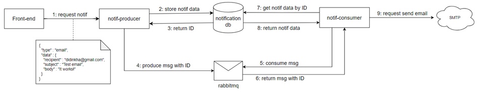

### Event-driven Notification Service

This repository contains an example of a scalable Event-driven Notification Service built using Golang, MySQL, and RabbitMQ. The service implements Clean Architecture to ensure a robust and maintainable codebase. Clean Architecture emphasizes separation of concerns and decoupling of components, making the codebase easier to understand, test, and extend.